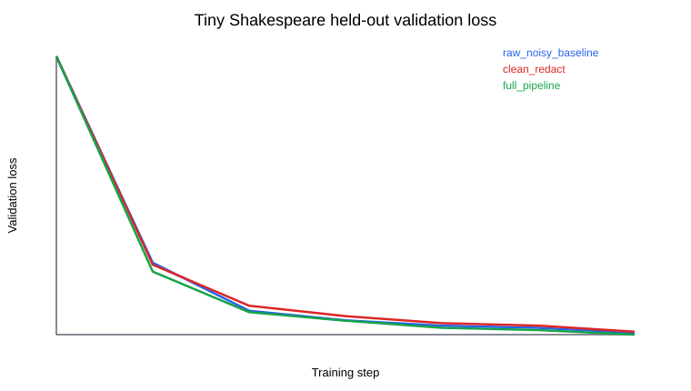
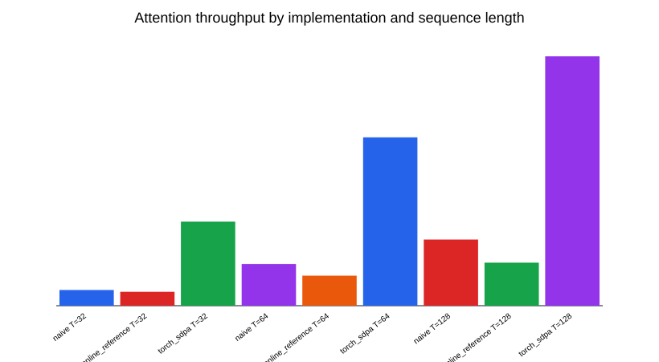

# LLM Data Quality and Efficient Attention Benchmark Platform

[](https://www.python.org/)
[](tests/)
[](docs/COVERAGE_REPORT.txt)
[](.github/workflows/ci.yml)
[](LICENSE)

A focused, CPU-runnable LLM systems project for measuring how data-quality controls affect compact language-model training and how attention implementations compare on correctness, throughput, and estimated memory. A supporting AI/ML implementation suite remains in `src/course_project_suite/` to demonstrate broader algorithmic foundations.

This is a **personal learning and portfolio project**. It does **not** claim CMU enrollment, institutional affiliation, official coursework completion, private-grader access, leaderboard placement, or authorization for a specific graded submission.

## Research question

How much do deterministic data-quality controls improve a compact GPT training corpus, and how do reference attention implementations compare under a reproducible local benchmark?

## Main results

The benchmark uses the public [Tiny Shakespeare corpus](data/tinyshakespeare/SOURCE.md), injects deterministic web-style and symbol-heavy OCR/template noise into the training subset, and evaluates against clean held-out text.

| Metric | Raw noisy baseline | Full pipeline | Change |
|---|---:|---:|---:|
| Duplicate rate | 9.0% | 0.0% | -9.0 pp |
| Email and phone hits | 48 | 0 | -100% |
| Quality-filter pass rate | 54.2% | 100.0% | +45.8 pp |
| Held-out GPT validation loss | 3.6923 | 3.5837 | -2.94% |
| Held-out GPT perplexity | 40.14 | 36.00 | -10.29% |

At sequence length `128`, PyTorch SDPA reached `3.77x` the naive reference throughput with an estimated `50.0%` lower algorithmic working set. CPU memory numbers are estimates; CUDA peak allocation is reported only when CUDA is used.





See the full [benchmark report](artifacts/llm_benchmark/REPORT.md) and structured [results JSON](artifacts/llm_benchmark/results.json).

## Benchmark design

- **Real public corpus:** Tiny Shakespeare, checksum-verified and cached locally.
- **Controlled stress test:** reproducible HTML, URL, PII, duplication, and symbol-heavy noise injection.
- **Baseline:** raw noisy documents.
- **Ablations:** cleaning/redaction, deduplication only, quality filtering only, and the full pipeline.
- **Model evaluation:** character-level Mini GPT trained on each selected corpus variant and evaluated against held-out clean text.
- **Systems evaluation:** naive attention, numerically stable online reference attention, and PyTorch SDPA.
- **Error analysis:** sanitized examples of removed documents and explicit benchmark limitations.

## Quick start

```bash
python -m pip install -r requirements.txt
python -m pip install -r requirements-dev.txt
python -m pip install -e .
python scripts/run_verification.py
python scripts/run_coverage.py
python scripts/run_llm_benchmark.py
```

Use the smaller CI-friendly benchmark when iterating:

```bash
python scripts/run_llm_benchmark.py --quick --output-dir artifacts/llm_benchmark_ci
```

## Supporting implementation suite

The supporting library includes:

- Search and planning: BFS, UCS, A*, Corners-style heuristic search.
- Multi-agent AI: minimax, alpha-beta pruning, expectimax.
- Reinforcement learning and inference: value iteration, Q-learning, HMM forward filtering, Viterbi, particle filtering.
- Classical ML: regression, decision trees, K-Means, anomaly detection, matrix factorization.
- Deep-learning foundations: affine/ReLU/softmax layers, batch normalization, convolution, pooling, RNN steps, attention.
- NLP and LLM foundations: PPMI, negative sampling, parsing utilities, GPT-style blocks, BPE, AdamW, scaling-law fitting, and DPO loss.

## Verification

```text
6/6 supporting project-family self-checks
20/20 unit, numerical, and regression tests
92% measured source coverage
repository format check
Python compile check
```

The GitHub Actions workflow runs coverage, a quick focused benchmark, and full verification. A live GitHub run badge can be added after publishing the repository.

## Academic submission boundary

Before using any part of this repository for academic credit, read [submission readiness](docs/SUBMISSION_READINESS_CHECKLIST.md) and complete the [provenance and assistance record](docs/PROVENANCE_AND_ASSISTANCE.md). A course-specific rubric and instructor authorization are still required.

## Limitations

- Tiny Shakespeare is a compact public corpus, not a production web crawl.
- Injected corruption is a controlled stress test, not an estimate of natural web noise.
- The Mini GPT experiment demonstrates comparative local behavior, not state-of-the-art model quality.
- The online attention implementation is a readable numerical reference, not a fused production kernel.

## License

MIT License. See [LICENSE](LICENSE).
