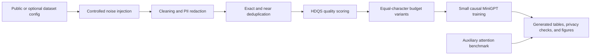

# LLM Data Quality Benchmark

[](https://www.python.org/)
[](LICENSE)

Reproducible paper prototype for **Data Quality Interventions for Small-Scale
Language Model Pretraining**. The primary contribution is an auditable data
pipeline with controlled corruption, exact and near deduplication, HDQS quality
scoring, privacy checks, equal-budget training comparisons, and generated
artifacts. A small attention benchmark is included as an auxiliary systems
measurement.

This is a **personal research and portfolio prototype**. It does **not** claim
enrollment at any institution, official coursework completion, competition
placement, private-grader access, paper acceptance, or institutional
affiliation.

## Research Question

How do deterministic data-quality interventions affect equal-budget
small-scale language-model pretraining under a controlled corruption stress
test?

## Quick Start

Quick mode is offline, CPU-runnable, and intentionally compact:

```bash
python -m pip install -r requirements.txt
python -m pip install -r requirements-dev.txt
python -m pip install -e .
python scripts/run_quick_experiment.py
python scripts/make_tables.py
python scripts/make_figures.py
python scripts/check_artifacts.py
python -m pytest tests -q
```

The generated quick report is in
[`artifacts/quick_experiment/REPORT.md`](artifacts/quick_experiment/REPORT.md).
Quick results are **single-seed smoke-test evidence**, not paper-level empirical
claims. The deterministic quick stress test verifies that the pipeline is
reproducible and shows a preliminary perplexity improvement for the full
pipeline over the raw noisy baseline. It does not prove a general model-quality
improvement. Use `python scripts/run_dataset_matrix.py --mode full` for the
larger multi-dataset entry point.

## Architecture



## Experiment Surface

- Dataset configs: local Tiny Shakespeare plus optional streamed WikiText-2,
  OpenWebText sample, and C4 sample adapters.
- Controlled stress test: 12 independently configurable synthetic noise
  families with deterministic seeds.
- Baselines and ablations: raw, cleaning, PII redaction, exact deduplication,
  near deduplication, rule filtering, proxy perplexity filtering, HDQS, and
  full-pipeline variants.
- Near-dedup methods: Jaccard reference deduplication for quick runs and
  MinHash/LSH for larger matrix runs.
- Fair comparison: all model variants are trimmed to one shared character
  budget by default.
- Model metrics: train loss, held-out loss, perplexity, bits per character,
  next-character accuracy, throughput, wall time, and optional CUDA peak
  allocation.
- Privacy checks: synthetic-canary removal recall, residual counts, redaction
  side effects, and a lightweight exposure-style reduction indicator.
- Auxiliary systems benchmark: naive attention, an online reference, and
  PyTorch SDPA with warmup, median, p25, p75, environment metadata, and
  estimated working-set language.

## Generated Evidence

Run the quick experiment before reading these generated files:

- [`main_results_table.md`](artifacts/quick_experiment/main_results_table.md)
- [`ablation_table.md`](artifacts/quick_experiment/ablation_table.md)
- [`dataset_card.json`](artifacts/quick_experiment/dataset_card.json)
- [`hdqs_sweep_report.json`](artifacts/quick_experiment/hdqs_sweep_report.json)
- [`privacy_report.json`](artifacts/quick_experiment/privacy_report.json)
- [`token_budget_report.json`](artifacts/quick_experiment/token_budget_report.json)
- [`quality_score_distribution.svg`](artifacts/quick_experiment/quality_score_distribution.svg)
- [`privacy_vs_utility.svg`](artifacts/quick_experiment/privacy_vs_utility.svg)
- [`attention_throughput.svg`](artifacts/quick_experiment/attention_throughput.svg)

## Reproducibility

The acceptance path is:

```bash
python scripts/check_repo.py
python scripts/run_quick_experiment.py
python scripts/make_tables.py
python scripts/make_figures.py
python scripts/check_artifacts.py
python -m pytest tests -q
ruff check .
black --check .
mypy src
```

See [datasets](docs/DATASETS.md), [method](docs/METHOD.md),
[experiments](docs/EXPERIMENTS.md), and
[reproducibility](docs/REPRODUCIBILITY.md).

## Submission Boundary

This repository is suitable as a portfolio prototype and as a foundation for a
research-style submission only after checking the actual rubric, dataset
policy, and assistance policy. Before any paper-style submission, run the
multi-seed and multi-dataset experiments listed in [limitations](docs/LIMITATIONS.md).

## Supporting Implementations

The broader implementation suite under `src/course_project_suite/` retains
search, reinforcement learning, classical ML, deep-learning layers, BPE,
decoder-only transformers, DPO loss, and systems exercises. These modules are
supporting foundations rather than the headline contribution.

## License

MIT License. See [LICENSE](LICENSE).
