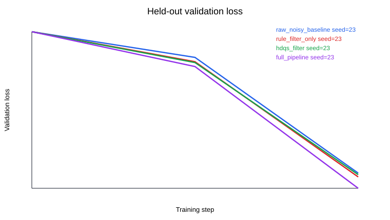
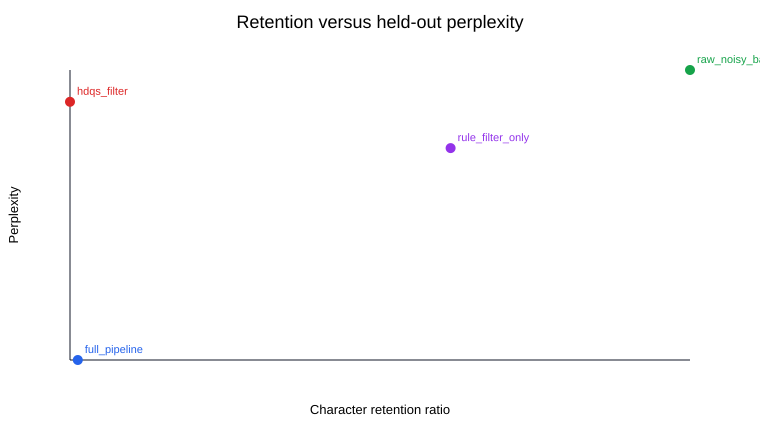
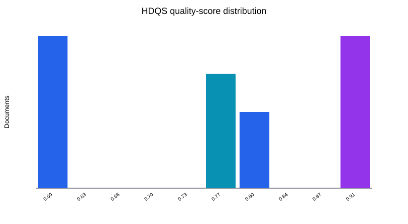
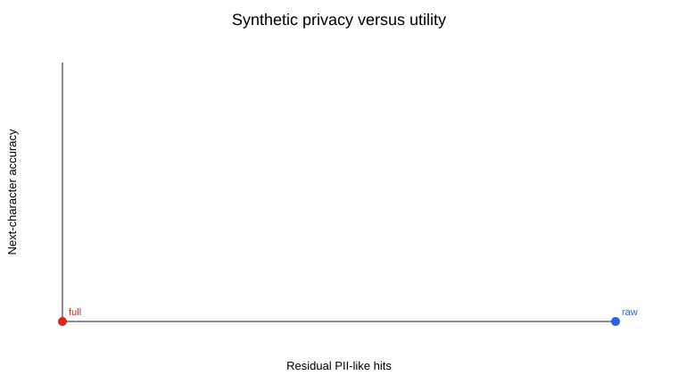
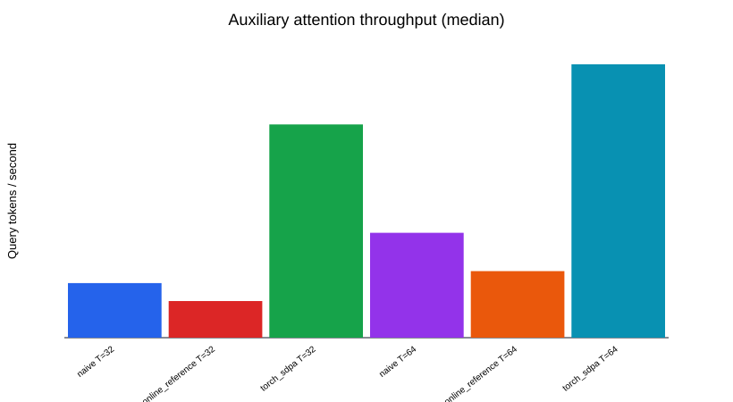

# LLM Data Quality Benchmark: Generated Experiment Report

Mode: `dataset_matrix_paper-prototype`

This report is generated from a reproducible local experiment. It is evidence for a paper prototype, not a paper acceptance or institutional-coursework claim.

## Research Question

How do deterministic data-quality interventions affect equal-budget small-scale language-model pretraining under a controlled corruption stress test?

## Data Processing

- Raw noisy documents: `13`
- Full-pipeline retained documents: `6`
- Raw PII-like hits: `9`
- Full-pipeline PII-like hits: `0`
- Equal character budget: `True`

## Model Summary

| Variant | Seeds | Validation loss mean +/- std | Perplexity mean +/- std | Next-char accuracy |
| --- | --- | ---: | ---: | ---: |
| `full_pipeline` | 23 | 13.6461 +/- 0.0000 | 844138.95 +/- 0.00 | 0.008 |
| `hdqs_filter` | 23 | 13.7970 +/- 0.0000 | 981624.07 +/- 0.00 | 0.008 |
| `raw_noisy_baseline` | 23 | 13.8141 +/- 0.0000 | 998585.94 +/- 0.00 | 0.008 |
| `rule_filter_only` | 23 | 13.7716 +/- 0.0000 | 957009.21 +/- 0.00 | 0.008 |

## Auxiliary Attention Benchmark

The attention measurements compare readable references with PyTorch SDPA. They are hardware-dependent systems measurements and not a novel attention-algorithm claim. CPU working-set values are estimates.

## Figures

## Limits

- Quick mode uses one seed and a compact CPU budget for smoke-test reproducibility.
- Standalone HDQS filtering is reported separately from the full pipeline; quick-mode artifacts do not support a claim that HDQS alone consistently improves model quality.
- Full multi-seed experiments remain necessary before making paper-level empirical claims.
- Tiny Shakespeare and injected corruption are controlled debugging instruments, not a production web-corpus evaluation.
