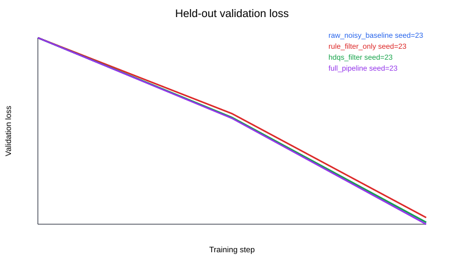
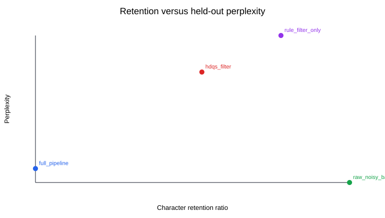
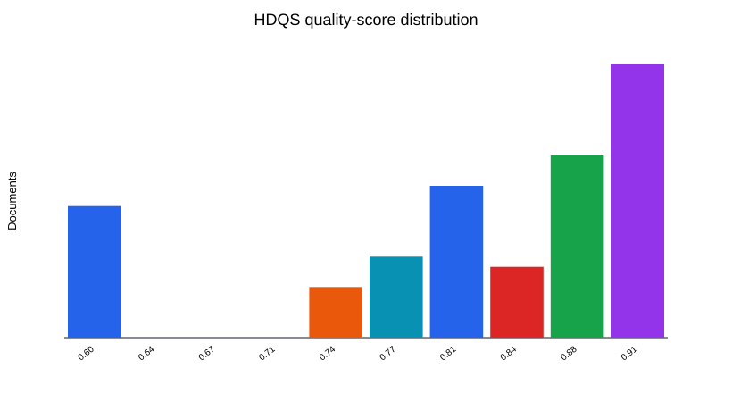
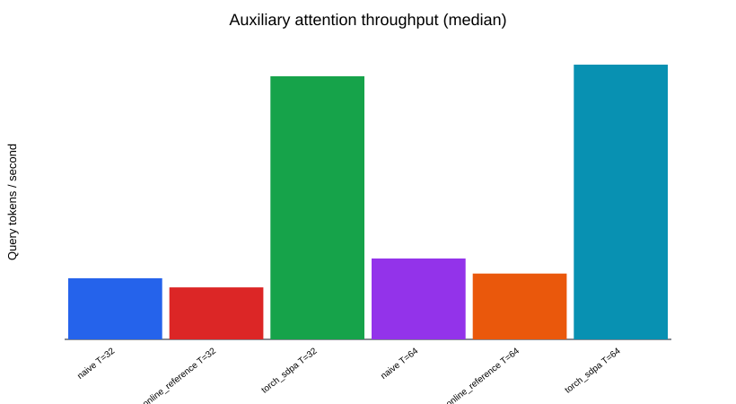

# LLM Data Quality Benchmark: Generated Experiment Report

Mode: `quick`

This report is generated from a reproducible local experiment. It is evidence for a paper prototype, not a paper acceptance or institutional-coursework claim.

## Research Question

How do deterministic data-quality interventions affect equal-budget small-scale language-model pretraining under a controlled corruption stress test?

## Data Processing

- Raw noisy documents: `93`
- Full-pipeline retained documents: `56`
- Raw PII-like hits: `39`
- Full-pipeline PII-like hits: `0`
- Equal character budget: `True`

## Model Summary

| Variant | Seeds | Validation loss mean +/- std | Perplexity mean +/- std | Next-char accuracy |
| --- | --- | ---: | ---: | ---: |
| `full_pipeline` | 23 | 12.2969 +/- 0.0000 | 219024.40 +/- 0.00 | 0.029 |
| `hdqs_filter` | 23 | 12.3315 +/- 0.0000 | 226734.25 +/- 0.00 | 0.029 |
| `raw_noisy_baseline` | 23 | 12.3286 +/- 0.0000 | 226073.44 +/- 0.00 | 0.029 |
| `rule_filter_only` | 23 | 12.4156 +/- 0.0000 | 246609.45 +/- 0.00 | 0.029 |

## Auxiliary Attention Benchmark

The attention measurements compare readable references with PyTorch SDPA. They are hardware-dependent systems measurements and not a novel attention-algorithm claim. CPU working-set values are estimates.

## Figures

## Limits

- Quick mode uses one seed and a compact CPU budget for smoke-test reproducibility.
- Full multi-seed experiments remain necessary before making paper-level empirical claims.
- Tiny Shakespeare and injected corruption are controlled debugging instruments, not a production web-corpus evaluation.
